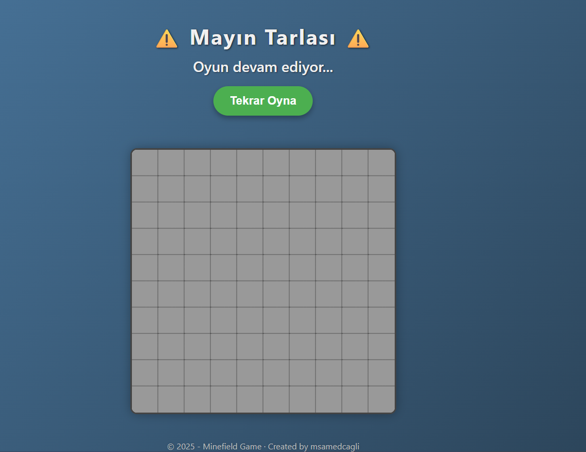
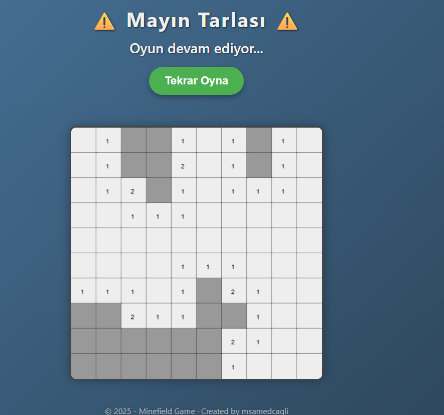
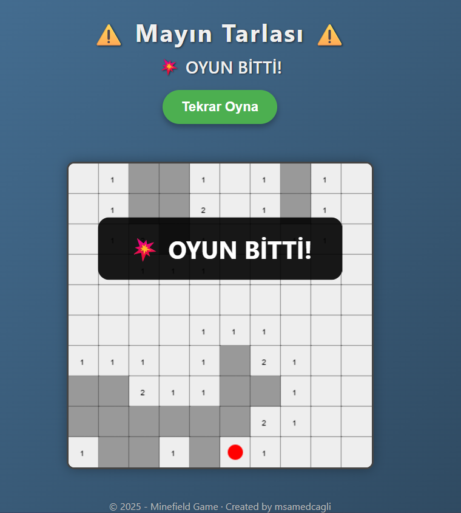
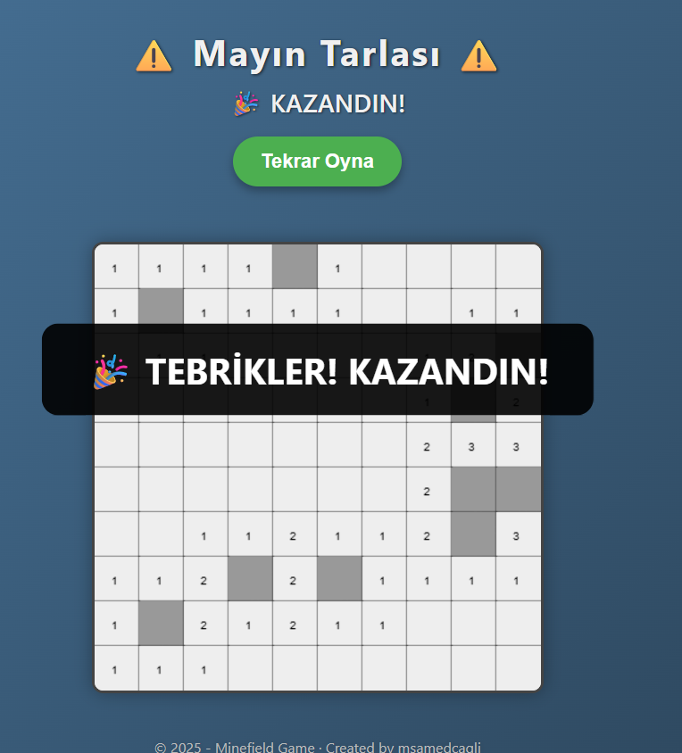

# Python Minefield

Flask kullanılarak Python ile geliştirilmiş klasik Mayın Tarlası (Minefield) oyunu.

## Uygulama Görselleri
|               Başlangıç              |              Oyun İçi Görüntü             |
| :----------------------------------: | :---------------------------------------: |
|                 |                     |
|         Kaybettiniz Görüntüsü        |          Kazandınız Görüntüsü             |
|              |                        |


## Gereksinimler

- Python 3.x
- Flask

```bash  
pip install flask
```

## Nasıl Oynanır?

1. Oyunu başlatmak için:
```bash  
python app.py
```

2. Oyun Kontrolleri:
- Sol Tık: Hücreyi aç
- Sağ Tık: Bayrak koy / kaldır
- R Tuşu: Oyunu sıfırla

3. Oyun Kuralları:
- Oyun alanı 10x10’luk bir ızgaradan oluşur ve 10 adet mayın içerir.
- Hücrelerdeki sayılar, çevresinde kaç mayın olduğunu gösterir.
- Bu sayılara göre mayınların yerlerini tahmin edin.
- Mayın olduğunu düşündüğünüz hücrelere bayrak yerleştirin.
- Tüm mayınsız hücreleri açarsanız oyunu kazanırsınız.
- Bir mayına tıklarsanız oyunu kaybedersiniz!

## Özellikler
- Klasik Minefield oynanışı
- Açılan hücreler ve bayraklar için görsel geri bildirim
- Kazanma ve kaybetme durumları
- Kolay oyun sıfırlama özelliği
- Temiz ve kullanıcı dostu arayüz 
